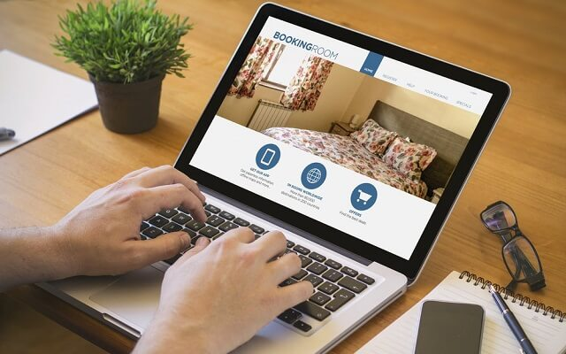

# Maximizing-Hotel-Bookings-
Maximizing Hotel Bookings An Excel Analysis Project
  
Maximizing Hotel Bookings with Data-Driven Insights: An Excel Analysis Project
In today's competitive hospitality industry, data-driven decision-making is essential for optimizing operations and enhancing guest experiences. I recently completed a comprehensive Excel analysis project on hotel booking data, from three different property and I’m excited to share my findings with you. This analysis sheds light on how advanced bookings, booking channels, and room types impact overall hotel performance.
## Project Overview
The dataset provided detailed information about hotel reservations, including average room rates, reservation statuses, booking channels, and guest stay durations. By leveraging Excel's powerful data analysis tools, I uncovered valuable insights that can help hotels optimize their booking strategies and improve occupancy rates.
Key Insights and Findings
1. Advanced Bookings and Their Impact:
    * High Completion Rate: Approximately 90% of advanced bookings were completed, indicating a strong commitment from guests who book in advance.
    * Extended Stays: Most extended reservations were made through the phone app, with 32.9% of advanced bookings occurring via this channel. Additionally, 50% of guests who booked in advance stayed for 7-14 days, highlighting the importance of targeting long-stay guests.
2. Booking Channels:
    * Phone App Dominance: The phone app emerged as a crucial booking channel, accounting for a significant portion of reservations. This channel also saw the highest number of extended stays, emphasizing the need to enhance the app experience.
    * Website Rates: The website booking channel had the highest average room rates, suggesting a potential area for maximizing revenue.
3. Room Types and Rates:
    * Executive Rooms: Despite having the highest average rate, executive rooms were the least booked. Promoting these rooms through targeted marketing could increase their occupancy.
    * Popular Room Types: Double rooms were the most booked, representing 26% of total reservations. Ensuring competitive pricing and availability for these rooms can help maintain high occupancy rates.
## Recommendations  
Based on these insights, I propose several recommendations for hotel managers and marketers:
* Enhance the Phone App Experience: Simplify the booking process and offer exclusive deals to encourage more app bookings.
* Promote Advanced Bookings: Implement marketing campaigns that highlight the benefits of booking in advance, such as early bird discounts and loyalty programs.
* Focus on Long-Stay Guests: Develop packages tailored to guests who stay for extended periods, offering discounted rates and value-added services.
* Optimize Room Rates: Regularly review and adjust room rates based on demand and competition, with special attention to the website booking channel.
* Increase Marketing for Less Popular Channels and Room Types: Promote walk-in reservations and the executive suite through targeted advertising and special promotions.
  
## Explore the Data Yourself
To help you dive deeper into these insights, I’ve made the Excel file used for this analysis available for download. You can explore the data, review the findings, and apply similar techniques to your own datasets.  

